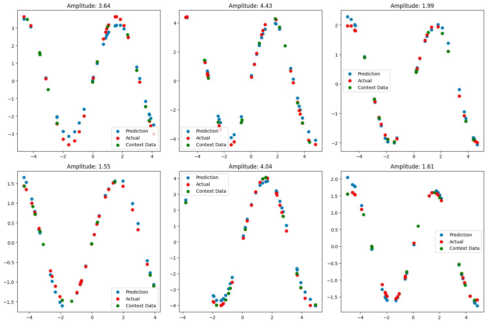
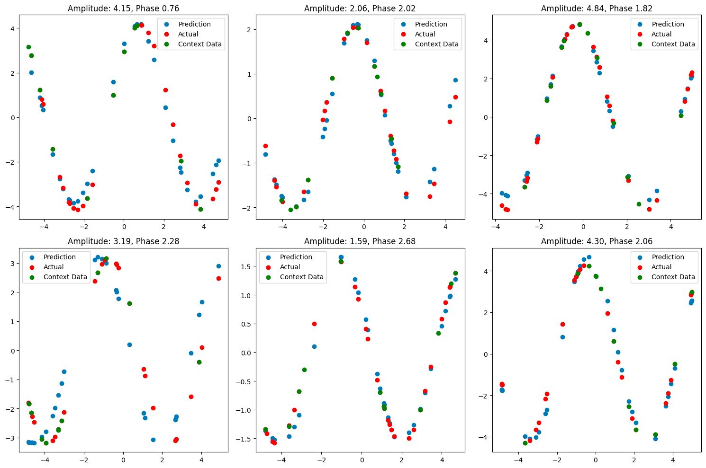
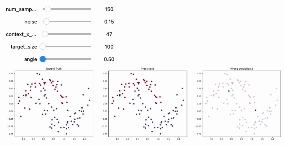
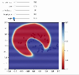
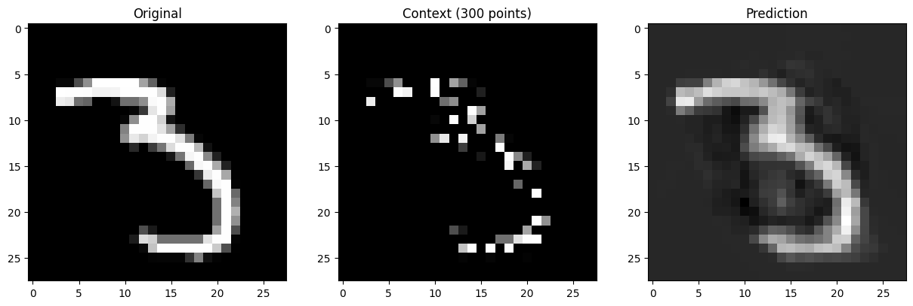

All the analysis and comparision is explained in the [Report](https://github.com/chirag-25/CNP/blob/main/Report.pdf).
# 1D regression sine wave

The idea was to see that whether the model can learn the sine wave function from a few context points after training the CNP on a variety of different amplitude, frequency and phases. We did multiple expirements warying both amplitude, phase and frequency of the data. For each expirment, we trained the data on around 100 context sets. 

The main goal was to train the model on multiple sin functions having amplitude, frequency and phase warrying in some particular ranges and build a model which can take a few points(context points) in the forward pass to determine the exact sine wave function and then predict on the target points accordingly. 

### 1. Training the model on a single sine wave function
In this experiment, we trained the model on a single sine wave function having fixed amplitude, frequency and phase. In this there was no work for the encoder and it was a simple regression problem. The model was working nicely. 

### 2. Training the model on multiple sine wave functions having different amplitudes
In this experiment, we trained the model on multiple sine wave functions having different amplitudes. We selected random 100 amplitudes between 1 and 5 to train the model. While testing we again gave any amplitude between 1 and 5. The model was able to predict the sine wave function nicely. This new amplitude in most of the cases not seen by the model during training.

### 3. Training the model on multiple sine wave functions having different amplitudes and phases
In this experiment, we trained the model on multiple sine wave functions having different amplitudes and phases. We selected random 100 amplitudes between 1 and 5 and random 100 phases between 0 and pi to train the model. While testing we again gave any amplitude between 1 and 5 and any phase between 0 and 2*pi. The model was able to predict the sine wave function nicely. This new amplitude and phase in most of the cases not seen by the model during training.

# Make Moons Dataset
In this experiment we trained the CNP on the rotated make moons dataset. The idea was to send a few context points(similar to few shots learning) in the forward pass which will help the model figure out the angle of rotation of the moons and then predict the target points accordingly. We took random 100 angles between 0 and 2*pi to train the model. While testing we again gave any angle between 0 and 2*pi. The model was able to predict the target points nicely. This new angle in most of the cases not seen by the model during training.

Here are the predictions on the test set:

# MNIST Dataset
This was the simple experiment of image completion using CNPs. We trained the model on MNIST dataset and then gave a 300 random context points in the forward pass to predict the target points(all 784 points). We were able to get good results.

